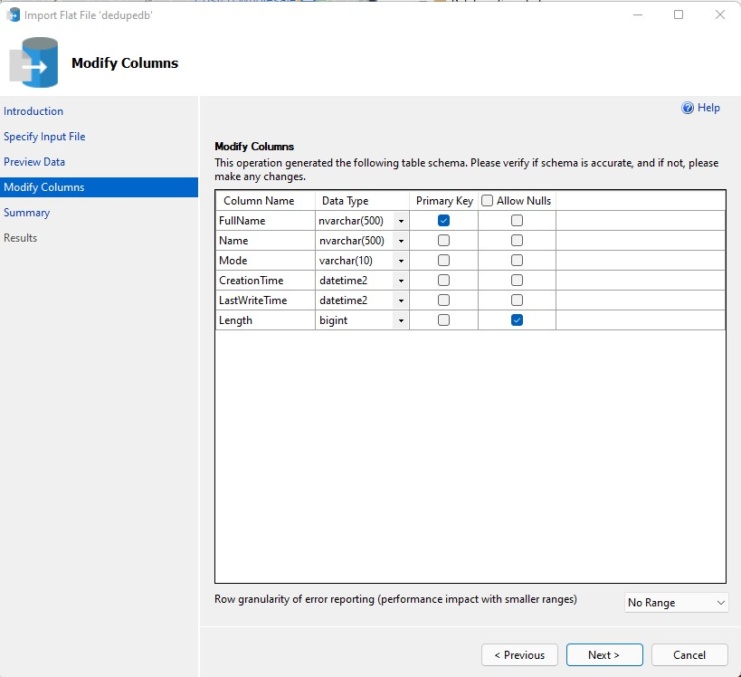

# dedupefolders
Dedupe folders on my drives

## How to use this?
1. Download/clone this repo
1. Open dedupefolders.ssmssln using SSMS v18+, and use the scripts in the scripts project dedupedb, for following steps.
1. On a SQL Server instance, create a database dedupedb, using the script createdb.sql
Create a csv file , that has information about your files and folders, using the command 
    ```
    Get-ChildItem -Recurse 'D:\' | Select-Object FullName, Name,  Mode, CreationTime, LastWriteTime, Length | Export-Csv -path 'C:\Users\marko\Downloads\filefolderinfo.csv' -noTypeInfo
    ```
1. In SSMS, right-click the database dedupedb, choose "Tasks > Import Flat File..." and choose the file filefolderinfo.csv. On the modify columns screen, modify the field to match the values shown: 
1. Run the script finddupes.sql
1. When you're all done, drop the database by running the script cleanup.sql